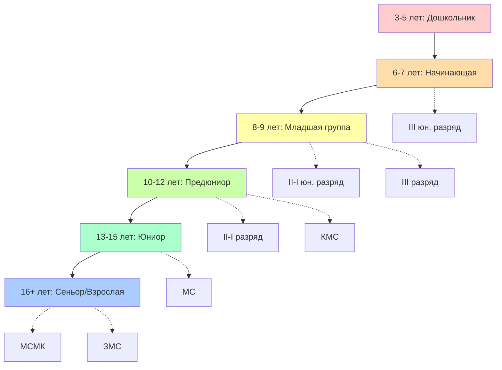
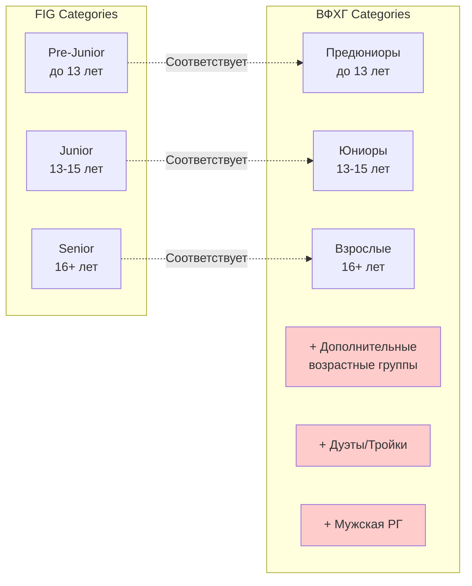
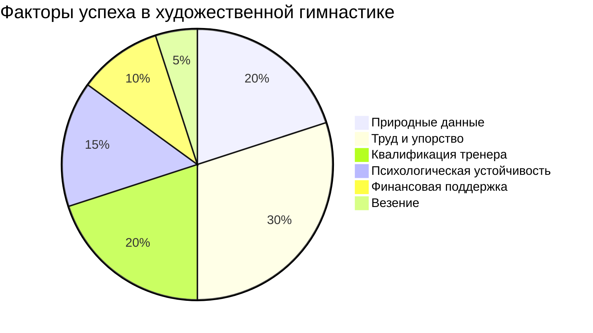

# Визуализация возрастных категорий и разрядов
# Age Categories and Ranks Visualization

## 📊 Наглядные схемы и диаграммы

---

## 1. Путь гимнастки: от новичка до чемпионки



---

## 2. Лестница разрядов и званий

```
                    ╔══════════════════════════════╗
                    ║  ЗМС - Заслуженный Мастер   ║
                    ║  Спорта России               ║
                    ╚══════════════════════════════╝
                              ▲
                              │ Выдающиеся достижения
                              │
                    ┌─────────────────────────────┐
                    │  МСМК - Мастер Спорта       │
                    │  Международного Класса       │
                    └─────────────────────────────┘
                              ▲
                              │ Олимпиада, ЧМ, ЧЕ
                              │
          ┌───────────────────────────────────────────┐
          │  МС - Мастер Спорта России                │
          │  • Возраст: 14-15+ лет                    │
          │  • Уровень: Чемпионаты России             │
          └───────────────────────────────────────────┘
                              ▲
                              │
    ┌─────────────────────────────────────────────────────┐
    │  КМС - Кандидат в Мастера Спорта                   │
    │  • Возраст: 12+ лет                                 │
    │  • Уровень: Всероссийские соревнования              │
    └─────────────────────────────────────────────────────┘
                              ▲
                              │
┌────────────────────────────────────────────────────────────┐
│  I спортивный разряд                                       │
│  • Возраст: 10+ лет                                        │
│  • Уровень: Региональные, всероссийские                    │
└────────────────────────────────────────────────────────────┘
                              ▲
                              │
        ┌─────────────────────────────────────────────┐
        │  II спортивный разряд                       │
        │  • Возраст: 9+ лет                          │
        │  • Уровень: Областные, межрегиональные       │
        └─────────────────────────────────────────────┘
                              ▲
                              │
                ┌─────────────────────────────────┐
                │  III спортивный разряд          │
                │  • Возраст: 8+ лет              │
                │  • Уровень: Городские, областные │
                └─────────────────────────────────┘
                              ▲
                              │
                        ┌─────────────────┐
                        │  I юношеский    │
                        │  разряд         │
                        └─────────────────┘
                              ▲
                              │
                          ┌───────────┐
                          │ II юн.    │
                          └───────────┘
                              ▲
                              │
                            ┌─────┐
                            │III  │
                            │юн.  │
                            └─────┘
                              ▲
                              │
                        ┌─────────────┐
                        │ НАЧИНАЮЩАЯ  │
                        └─────────────┘
```

---

## 3. Временная шкала типичной карьеры

```
Возраст │
лет     │ Категория          Разряды              Соревнования
────────┼───────────────────────────────────────────────────────
   3-5  │ ╔══════════════╗
        │ ║ Дошкольник   ║   ---                Нет
        │ ╚══════════════╝
   6-7  │ ┌──────────────┐
        │ │ Начинающая   │   III юн.            Клубные
        │ └──────────────┘
   8-9  │ ┌──────────────┐
        │ │ Младшая      │   II юн., I юн.      Районные,
        │ │ группа       │   III разряд         городские
        │ └──────────────┘
  10-12 │ ┌──────────────┐
        │ │ Предюниор    │   II, I разряд       Областные,
        │ │              │   КМС                региональные
        │ └──────────────┘
  13-15 │ ┌──────────────┐
        │ │ Юниор        │   КМС, МС            Первенства РФ,
        │ │              │                       международные
        │ └──────────────┘
  16-20 │ ┌──────────────┐
        │ │ Сеньор       │   МС, МСМК           Чемпионаты РФ,
        │ │ (молодая)    │                       ЧМ, ЧЕ
        │ └──────────────┘
  21-25 │ ┌──────────────┐
        │ │ Сеньор       │   МСМК, ЗМС          Олимпиада,
        │ │ (пик)        │                       ЧМ
        │ └──────────────┘
  26+   │ ┌──────────────┐
        │ │ Завершение   │   Сохраняется        Показательные
        │ │ или тренер   │   пожизненно         выступления
        │ └──────────────┘
```

---

## 4. Частота тренировок по возрастам

```
Часов в неделю
    │
 40 │                                          ████████
    │                                      ████████████
 35 │                                  ████████████████
    │                              ████████████████████
 30 │                          ████████████████████████
    │                      ████████████████████████████
 25 │                  ████████████████████████████████
    │              ████████████████████████████████████
 20 │          ████████████████████████████████████████
    │      ████████████████████████████████████████████
 15 │  ████████████████████████████████████████████████
    │  ████████████████████████████████████████████████
 10 │  ████████████████████████████████████████████████
    │  ████████████████████████████████████████████████
  5 │  ████████████████████████████████████████████████
    │  ████████████████████████████████████████████████
  0 └──────────────────────────────────────────────────
    3-5  6-7  8-9  10-12 13-15  16+   Возраст (лет)

    3-5   лет:  3-5 часов в неделю
    6-7   лет:  5-7 часов
    8-9   лет:  8-12 часов
    10-12 лет:  12-18 часов
    13-15 лет:  18-25 часов
    16+   лет:  25-40 часов
```

---

## 5. Сравнение FIG и ВФХГ категорий



---

## 6. Количество соревнований в год

```
Соревнований в год
    │
 15 │                                      ████
    │                                      ████
    │                                  ████████
 12 │                                  ████████
    │                              ████████████
    │                              ████████████
 10 │                          ████████████████
    │                          ████████████████
    │                      ████████████████████
  8 │                      ████████████████████
    │                  ████████████████████████
    │              ████████████████████████████
  6 │              ████████████████████████████
    │          ████████████████████████████████
    │      ████████████████████████████████████
  4 │      ████████████████████████████████████
    │  ████████████████████████████████████████
    │  ████████████████████████████████████████
  2 │  ████████████████████████████████████████
    │  ████████████████████████████████████████
  0 └──────────────────────────────────────────
    Нач.  Мл.  Пред. Юн.  Сен.  Уровень

Начинающие:   2-3 соревнования
Младшая гр:   3-5 соревнований
Предюниоры:   4-6 соревнований
Юниоры:       6-10 соревнований
Сеньоры:      8-15 соревнований
```

---

## 7. Стоимость занятий по уровням (₽/год)

```
Тысяч рублей в год
    │
1500│                                          ████
    │                                      ████████
    │                                  ████████████
1000│                              ████████████████
    │                          ████████████████████
    │                      ████████████████████████
 500│                  ████████████████████████████
    │              ████████████████████████████████
    │          ████████████████████████████████████
 250│      ████████████████████████████████████████
    │  ████████████████████████████████████████████
  50│  ████████████████████████████████████████████
    └──────────────────────────────────────────────
    Нач.  Сред. Выс.  Уровень

    Начинающие:    50-200 тыс. ₽/год
    Средний:       150-500 тыс. ₽/год
    Высокий:       400-1500 тыс. ₽/год
```

---

## 8. Распределение времени на тренировке

### Начинающие (90 минут)

```
┌────────────────────────────────────────────────┐
│ Разминка           │ 15 мин (17%)              │
├────────────────────────────────────────────────┤
│ Хореография        │ 20 мин (22%)              │
├────────────────────────────────────────────────┤
│ Растяжка           │ 25 мин (28%)              │
├────────────────────────────────────────────────┤
│ Предметы           │ 20 мин (22%)              │
├────────────────────────────────────────────────┤
│ Программа          │ 10 мин (11%)              │
└────────────────────────────────────────────────┘
```

### Профессионалы (240 минут)

```
┌────────────────────────────────────────────────┐
│ Разминка           │ 25 мин (10%)              │
├────────────────────────────────────────────────┤
│ Хореография        │ 40 мин (17%)              │
├────────────────────────────────────────────────┤
│ Растяжка+Сила      │ 45 мин (19%)              │
├────────────────────────────────────────────────┤
│ Предметы           │ 60 мин (25%)              │
├────────────────────────────────────────────────┤
│ Программы          │ 60 мин (25%)              │
├────────────────────────────────────────────────┤
│ Заминка            │ 10 мин (4%)               │
└────────────────────────────────────────────────┘
```

---

## 9. Прогрессия сложности (D-score)

```
D-score
    │
 25 │                                          ████
    │                                      ████████
    │                                  ████████████
 20 │                              ████████████████
    │                          ████████████████████
    │                      ████████████████████████
 15 │                  ████████████████████████████
    │              ████████████████████████████████
    │          ████████████████████████████████████
 10 │      ████████████████████████████████████████
    │  ████████████████████████████████████████████
  5 │  ████████████████████████████████████████████
    │  ████████████████████████████████████████████
  0 └──────────────────────────────────────────────
    Нач.   Мл.   Пред.  Юн.   Сен.  Уровень

Начинающие:   1-3 (основы)
Младшая:      3-6 (базовые элементы)
Предюниоры:   6-12 (средняя сложность)
Юниоры:       12-20 (высокая сложность)
Сеньоры:      18-25+ (максимальная сложность)
```

---

## 10. Диаграмма успеха



---

## 11. Пирамида гимнасток в России

```
                    ▲
                   ╱ ╲ ЗМС
                  ╱   ╲ ~10-20 человек
                 ╱─────╲
                ╱       ╲ МСМК
               ╱         ╲ ~100-200 человек
              ╱───────────╲
             ╱             ╲ МС
            ╱               ╲ ~1000-2000 человек
           ╱─────────────────╲
          ╱                   ╲ КМС
         ╱                     ╲ ~5000-10000
        ╱───────────────────────╲
       ╱                         ╲ Разрядники (I-III)
      ╱                           ╲ ~50000-100000
     ╱─────────────────────────────╲
    ╱                               ╲ Начинающие
   ╱                                 ╲ ~200000-300000
  ╱───────────────────────────────────╲
```

---

**Дата создания:** 26 ноября 2024
**Статус:** Визуализации актуальны

---

*Цифры приблизительные и могут варьироваться год от года.*
