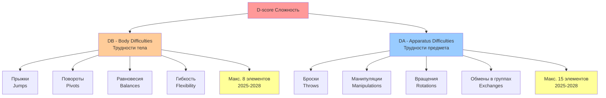
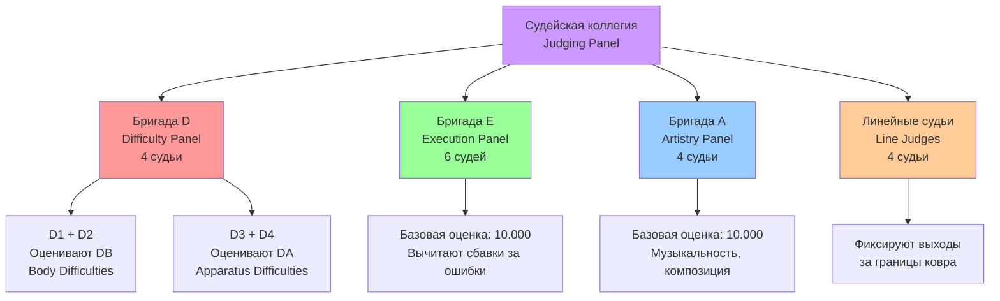
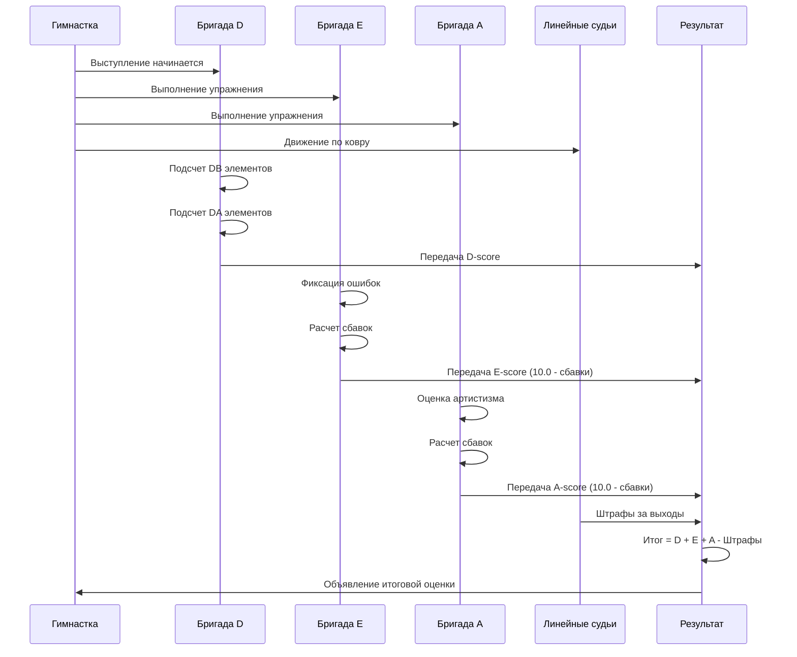
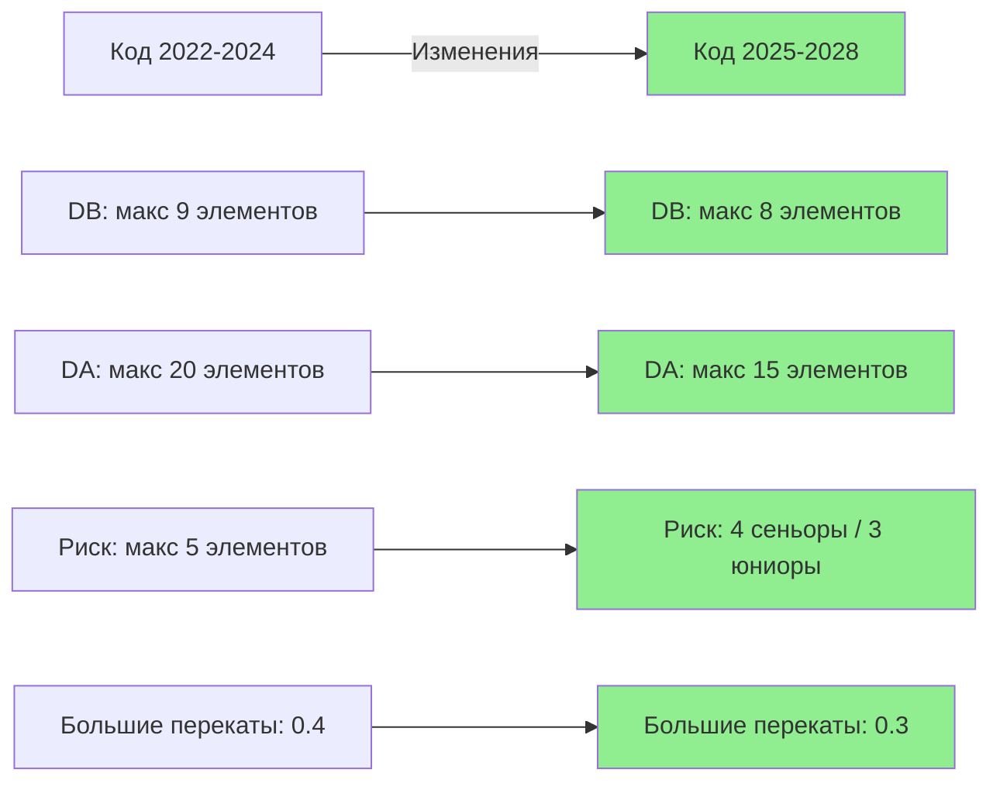
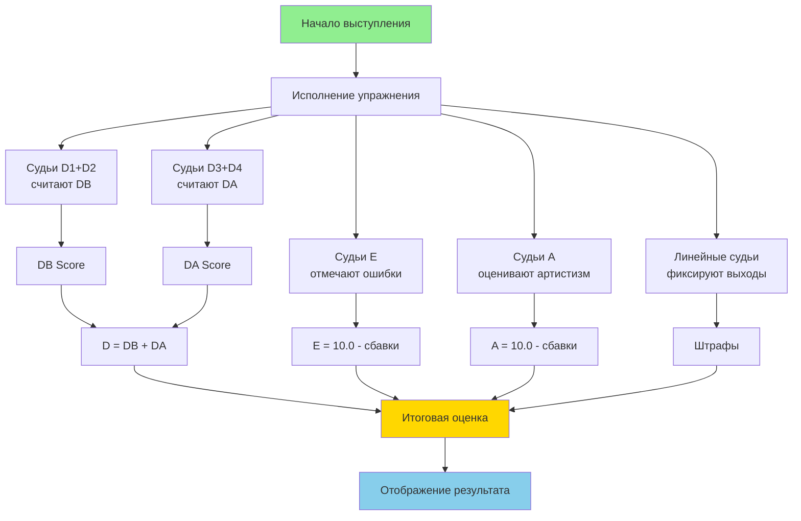

# Система оценивания в художественной гимнастике
# Rhythmic Gymnastics Scoring System Visualization

## 🎯 Диаграммы и схемы

---

## 1. Формула итоговой оценки

```
╔══════════════════════════════════════════════════════════╗
║                 ИТОГОВАЯ ОЦЕНКА / FINAL SCORE            ║
╚══════════════════════════════════════════════════════════╝
                           ║
                           ║
        ┏━━━━━━━━━━━━━━━━━━┻━━━━━━━━━━━━━━━━━━┓
        ┃                                       ┃
        ▼                                       ▼
  ┌─────────┐                             ┌─────────┐
  │    D    │      +      E      +    A   │  Штрафы │
  │ Difficulty│                            │ Penalties│
  └─────────┘                             └─────────┘
        │
        │
    ┌───┴───┐
    │       │
    ▼       ▼
  ┌────┐ ┌────┐
  │ DB │ │ DA │
  │Body│ │App.│
  └────┘ └────┘

Формула: Итоговая оценка = D + E + A - Штрафы

Где:
  D = DB + DA (Difficulty = Body + Apparatus)
  E = 10.000 - сбавки (Execution)
  A = 10.000 - сбавки (Artistry)
```

---

## 2. Структура оценки сложности (D-score)



---

## 3. Судейские бригады



---

## 4. Процесс оценивания (пошагово)



---

## 5. Шкала сбавок Execution (E-score)

```
╔════════════════════════════════════════════════════════╗
║           БАЗОВАЯ ОЦЕНКА EXECUTION: 10.000             ║
╚════════════════════════════════════════════════════════╝
                        ║
         ╔══════════════╩══════════════╗
         ║  Вычитаются сбавки за:     ║
         ╚═════════════════════════════╝
                        │
        ┌───────────────┼───────────────┐
        │               │               │
        ▼               ▼               ▼
  ┌──────────┐    ┌──────────┐   ┌──────────┐
  │  Малая   │    │ Средняя  │   │  Грубая  │
  │  ошибка  │    │  ошибка  │   │  ошибка  │
  │          │    │          │   │          │
  │  -0.10   │    │ -0.30    │   │  -0.70   │
  │   балла  │    │  -0.50   │   │  -1.00   │
  └──────────┘    └──────────┘   └──────────┘
       │               │               │
       │               │               │
       ▼               ▼               ▼
  • Недостаток   • Неправильная  • Падение
    амплитуды      техника       • Потеря
  • Малые        • Незначительная  предмета
    отклонения     потеря         далеко
  • Небольшие      контроля
    неточности
```

---

## 6. Распределение баллов по компонентам

```
┌─────────────────────────────────────────────────────┐
│  ТИПИЧНОЕ РАСПРЕДЕЛЕНИЕ БАЛЛОВ (ПРИМЕР)            │
├─────────────────────────────────────────────────────┤
│                                                     │
│  D-score (Сложность):        15.000 - 25.000+     │
│  ├─ DB (Body):                8.000 - 12.000       │
│  └─ DA (Apparatus):           7.000 - 13.000       │
│                                                     │
│  E-score (Исполнение):        7.500 - 9.500       │
│  (Базовая 10.0 минус сбавки)                       │
│                                                     │
│  A-score (Артистизм):         8.000 - 9.800       │
│  (Базовая 10.0 минус сбавки)                       │
│                                                     │
│  Штрафы:                      -0.000 до -2.000     │
│  (время, дисциплина, музыка и др.)                 │
│                                                     │
│  ═══════════════════════════════════════════════   │
│                                                     │
│  ИТОГОВАЯ ОЦЕНКА:             30.000 - 42.000+     │
│  (для высокого уровня)                             │
└─────────────────────────────────────────────────────┘

Примечание: Диапазоны указаны для гимнасток высокого уровня.
Для начинающих итоговые оценки значительно ниже.
```

---

## 7. Изменения в цикле 2025-2028



---

## 8. Временная шкала упражнения

### Индивидуальное упражнение

```
0:00                    1:15                    1:30         1:45
├───────────────────────┼───────────────────────┼────────────┤
│  ⚠️ Слишком рано     │   ✅ НОРМА            │ ⚠️ Слишком │
│  Сбавка: -0.05/сек   │   75-90 секунд        │    поздно  │
│                       │   (1:15 - 1:30)       │ -0.05/сек  │
└───────────────────────┴───────────────────────┴────────────┘

Дополнительно:
⚠️ Несоответствие музыке (закончила раньше/позже музыки): -0.30
```

### Групповое упражнение

```
0:00                              2:15                    2:30
├─────────────────────────────────┼───────────────────────┼─────
│  ⚠️ Слишком рано                │   ✅ НОРМА            │ ⚠️
│  Сбавка: -0.05/сек              │   135-150 секунд      │
│                                  │   (2:15 - 2:30)       │
└─────────────────────────────────┴───────────────────────┴─────

```

---

## 9. Стоимость элементов сложности

### Body Difficulties (DB) - примеры стоимости

```
┌─────────────────────────────────────────────────────┐
│             СТОИМОСТЬ DB ЭЛЕМЕНТОВ                  │
├─────────────────────────────────────────────────────┤
│                                                     │
│  0.1 балла  ████                                   │
│  - Простые прыжки с поворотом 360°                 │
│  - Базовые равновесия                              │
│                                                     │
│  0.2 балла  ████████                               │
│  - Прыжки средней сложности                        │
│  - Повороты 540-720°                               │
│                                                     │
│  0.3 балла  ████████████                           │
│  - Сложные прыжки с поворотом 720°+                │
│  - Динамические элементы с вращением               │
│                                                     │
│  0.4+ балла ████████████████                       │
│  - Уникальные элементы высокой сложности           │
│  - Комбинации нескольких критериев                 │
│                                                     │
└─────────────────────────────────────────────────────┘
```

### Apparatus Difficulties (DA) - стоимость по предметам

```
┌────────────────────────────────────────────────────────┐
│        СТОИМОСТЬ DA ЭЛЕМЕНТОВ (2025-2028)             │
├────────────────────────────────────────────────────────┤
│                                                        │
│  ОБРУЧ и МЯЧ:                                         │
│  ├─ Отбивы, вращения, проходы:        0.2 █████       │
│  ├─ Большие перекаты (NEW):           0.3 ████████    │
│  │  (было 0.4 в 2022-2024)                            │
│  └─ Ловли после высоких бросков:      0.4 ██████████  │
│                                                        │
│  БУЛАВЫ:                                              │
│  ├─ Минимальная база:                 0.2 █████       │
│  ├─ Средняя сложность:                0.3 ████████    │
│  └─ Максимальная база:                0.4 ██████████  │
│                                                        │
│  ЛЕНТА:                                               │
│  ├─ Змейки, спирали, восьмерки:       0.2 █████       │
│  ├─ Сложные манипуляции:              0.3 ████████    │
│  └─ Броски с ловлей:                  0.3-0.4 ████    │
│                                                        │
└────────────────────────────────────────────────────────┘
```

---

## 10. Типичные штрафы

```
╔═══════════════════════════════════════════════════════╗
║                  ШТРАФЫ / PENALTIES                   ║
╚═══════════════════════════════════════════════════════╝

┌───────────────────────────────────────────┬──────────┐
│ Нарушение                                 │  Штраф   │
├───────────────────────────────────────────┼──────────┤
│ Выход гимнастки за ковер                 │  -0.20   │
│ Выход предмета за ковер                  │  -0.20   │
│ Потеря предмета в конце упражнения       │  -0.50   │
│ Неправильный выход на ковер              │  -0.50   │
│ Несоответствие музыке                    │  -0.30   │
│ Нарушение времени (за каждую секунду)    │  -0.05   │
│ Нетипичная музыка                        │  -0.50   │
│ DA во время танцевальных шагов (2025+)   │  -0.30   │
└───────────────────────────────────────────┴──────────┘
```

---

## 11. Граф зависимостей оценки



---

## 12. Сравнение оценок: начинающие vs профессионалы

```
╔═══════════════════════════════════════════════════════════╗
║        СРАВНЕНИЕ УРОВНЕЙ ПОДГОТОВКИ                      ║
╚═══════════════════════════════════════════════════════════╝

НАЧИНАЮЩИЕ (1-2 год занятий)
┌──────────────────────────────────────┐
│ D-score:  2.000 - 5.000   ███        │
│ E-score:  5.000 - 7.000   ███████    │
│ A-score:  6.000 - 7.500   ████████   │
│ Штрафы:   -0.500 - -2.000            │
│ ═════════════════════════════════    │
│ ИТОГО:    12.000 - 17.000 ████       │
└──────────────────────────────────────┘

СРЕДНИЙ УРОВЕНЬ (4-6 лет занятий, I разряд)
┌──────────────────────────────────────┐
│ D-score:  8.000 - 12.000  ████████   │
│ E-score:  7.000 - 8.500   █████████  │
│ A-score:  7.500 - 8.500   ██████████ │
│ Штрафы:   -0.200 - -1.000            │
│ ═════════════════════════════════    │
│ ИТОГО:    22.000 - 28.000 ████████   │
└──────────────────────────────────────┘

ПРОФЕССИОНАЛЫ (МС, МСМК)
┌──────────────────────────────────────┐
│ D-score:  15.000 - 25.000 ████████████│
│ E-score:  8.500 - 9.500   ████████████│
│ A-score:  8.500 - 9.800   ████████████│
│ Штрафы:   -0.000 - -0.500            │
│ ═════════════════════════════════    │
│ ИТОГО:    32.000 - 44.000 ████████████│
└──────────────────────────────────────┘
```

---

## 13. Ключевые моменты для понимания

### ✅ Что важно знать:

1. **D-score (Сложность) - открытая шкала**
   - Нет максимального предела
   - Чем сложнее элементы, тем выше оценка
   - Но должны быть выполнены чисто!

2. **E-score (Исполнение) - закрытая шкала**
   - Максимум 10.000
   - Чем больше ошибок, тем ниже оценка
   - Идеальное исполнение = 10.000

3. **A-score (Артистизм) - закрытая шкала**
   - Максимум 10.000
   - Оценивает выразительность и композицию
   - Важна гармония музыки и движения

4. **Штрафы - дополнительные вычеты**
   - За нарушение времени, выходы, дисциплину
   - Можно избежать при правильной подготовке

### 🎯 Стратегия высоких оценок:

```
   Высокая D          Чистое E           Красивая A
   (сложность)    +  (исполнение)    +  (артистизм)
        │                  │                  │
        └──────────────────┴──────────────────┘
                           │
                    Минимум штрафов
                           │
                           ▼
                   Высокая итоговая оценка
```

---

**Дата создания:** 26 ноября 2024
**Версия:** FIG Code of Points 2025-2028
**Статус:** Актуально

---

*Для профессионального использования всегда сверяйтесь с официальным Кодом оценки FIG.*
